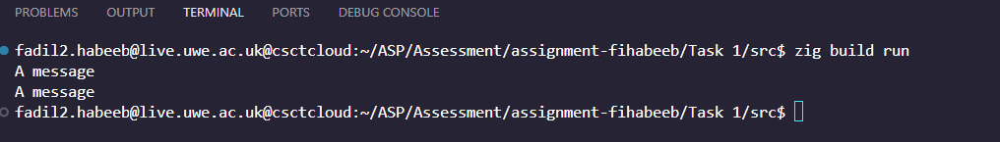
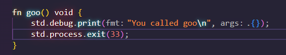
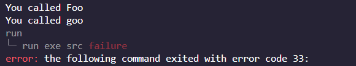
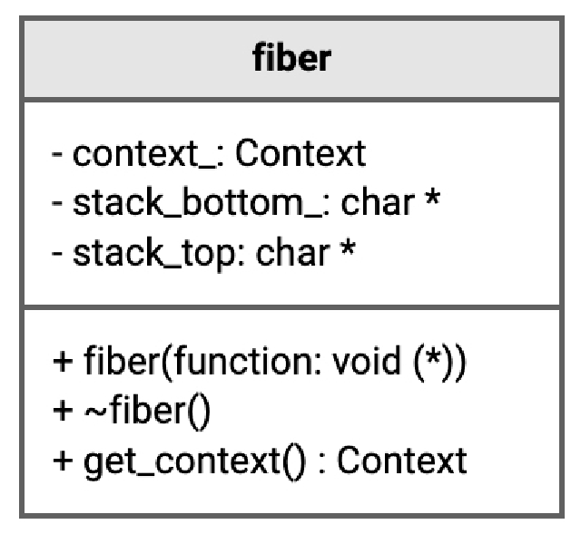
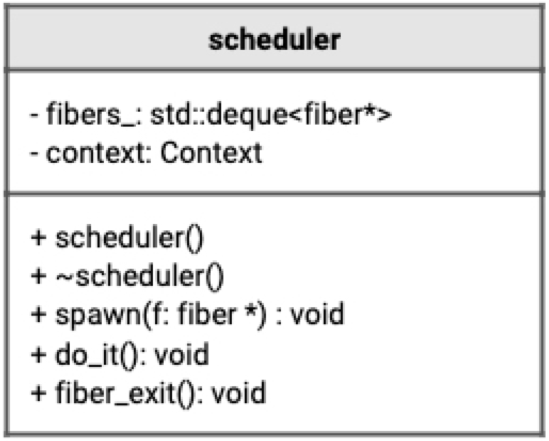
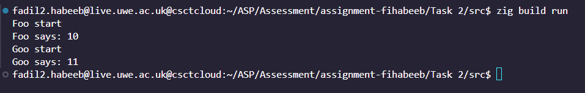

# Advanced Software Development Assignment

## How to run

- Go into the desired task in the terminal
- Go into src, example `./Task 2/src`
- Run `zig build run`

For task 1, since it includes two files for its 2 parts:

- Open the file `./Task 1/src/build.zig`
- Change line 23 from `b.path("src/p1.zig")` to `b.path("src/p2.zig")`.

## Overview

The goal of this assignment is to implement a simple runtime that supports
coperative tasks running within a single thread.

The assignment is split into 3 tasks.

## Provided code

A small library, stored in `./clib` was provided to support the development of the program. A file in `Assembly` titles `context.s` had the neccessary low-level implementation for the `context` functions. For `Zig` to access the `assembly` code, `context.h, context.o` are used.


## Task 1

#### Part One

The first part of task one was to implement a simple example of `context` being used. Here, `get_context()` and `set_context()` are used. The program, aims to `get_context()` in the start of `main`, then once it prints "a message" once, it calls `set_context()` to return to the beginning of `main`, printing "a message" once more.


`get_context()` saves the current state of execution so that it is possible to return
to with the use of `set_context()`. `set_context()` returns to a previously saved context.

To assist in this part's implementation, the following pseudo-code was provided.
```
1 set x to 0
2 set c to get_context
3 output "a message"
4 if x == 0:
5 set x to x PLUS 1
6 call set_context with c
```

Expected output:
```bash
a message
a message
```

The implementation can be found in [p1.zig](./Task%201/src/p1.zig):



#### Part Two

The first part of task one showcased how `get_context()` and `set_context()` work in a basic manner, part two aims to integrate some `fiber` behaviours. A `fiber` is a lightweight unit of execution that runs within a single thread.

The following pseudo-code was also provided for assistance:

```
1 func foo:
2 output "you called foo"
3 # cannot return to main as they have different stack
5
6 func main:
7 # allocate space for stack
8 data is an array of 4096 characters
9
10 # stacks grow downwards
11 sp is a pointer to characters
12 set sp to sp AND -16L
13 set sp to sp MINUS 128
14 set sp to be data PLUS 4096
15 create an empty context c
16 set rip of c to foo;
17 set rsp of c to sp;
18
19 call set_context with c
```


The implementation can be found in [p2.zig](./Task%201/src/p2.zig)

The implementation consists of an two "`fibers`" for demonstration purposes.


A global `context.Context` variable `c` is created, it is then given a function's pointer, `c.rip = fp`, and a stack pointer, `c.rsp = sp"`.

`fp` is the pointer to whatever function you want `c` to call.

`sp` is the "stack pointer" to the top of the stack given to a `fiber`.

When [p2.zig](./Task%201/src/p2.zig) is run, it will crash with an exit code we provided to it. This is because, in the program's current state, it doesn't know what to do at the end of the function given to a `fiber`. In this case, the program is exited with `std.process.exit(ERROR_CODE);`, to force it to stop.

Error code provided:



Program running and exiting with provided error code: 


## Task 2

Task 2 is to use turn Task 1/ Part 2, into a `class`, a `struct` in `Zig`'s case, using what we learn't about its properties.

To achieve this, a `struct` was written that follows this class diagram: 

This psuedo-code was also provided to help add the new `struct` to the previous work:
```
1 # implementation of fiber class
2 class fiber:
3 ...
4
5 func foo:
6 ...
7
8 func main:
9 set f by creating fiber with foo
10
11 set c calling method function get_context from f
12 call set_context with c
```

### Breakdown of the methods of `fiber`

#### Constructor `init()`:

The constructor manages the creation of an instance of the `fiber` struct, as well as all the set up for the `rsp` and `rip` that was discussed in Task 1.


It then returns a `pointer` to a newly created `fiber`.

#### Deconstructor `deinit()`:

It releases memory that the `fiber` allocated during its lifetime.

#### `get_context()`:

Returns the `context: context.Context` value.

### Breakdown of the attributes of `fiber`

- context_: the `fiber`'s context
- stack_bottom_: changed to `data_` in the implementation to avoid confusion. it is the `data` variable used for setting up the `rsp`.
- stack_top: points to the top of the `fiber`'s appointed stack.


### Scheduler

The next step is to add a `Scheduler` to introduce the ability to add fibers into a `queue`, and to take back control when a fiber calls `yield()`.

The following picture and pseudo-code were provided to us for assistance: 

```
1 class scheduler:
2 property queue of fiber pointer fibers_
3 property Context pointer context_
4
5 method spawn with a fiber f:
6 push f to back of fibers_
7
8 method do_it:
9 # return here to re-enter scheduler
10 call get_context with context_
11
12 if fibers_ is not empty:
13 set f by poping from of fibers_
14
15 # jump to task
16 set c calling method function get_context from f
17 call set_context with c
18 method fiber_exit:
19 # jump back to the scheduler 'loop'
20 call set_context with context_
```


### Breakdown of the methods of `scheduler`

#### Constructor `init()`:

The constructor manages the creation of an instance of the `scheduler` struct.

#### Deconstructor `deinit()`:

It releases memory that the `scheduler` allocated during its lifetime.

#### Spawn `spawn(f: *Fiber)`:

This function adds the provided fiber `f` to the queue.

#### Do it `do_it()`:

This function runs all the fibers found in the queue.

#### Fiber Exit `fiber_exit()`:

This function provides isolated functions called by `context` a way of returning to the `scheduler`.

### Breakdown of the attributes of `fiber`

- fibers_: this is some sort of list (specifically a `deque` in this instance) where all the `fiber`s are stored.
- context_: the `fiber`'s context

### Use of `deque`

`deque` was to be used for its simplistic way of adding and removing `fiber`s from itself, however, it presented an issue for Task 3 and had to be replaced wih `ArrayList`.


### Concluding Task 2

Once the two classes were implemented, they were tested with an implementation of the following pseudo-code:

```
1 func func1:
2 output "fiber 1"
3 set dp to get_data
4 output "fiber 1: " *dp
5 set *dp to *dp PLUS 1
6 call fiber_exit
7
8 func func2:
9 set dp to get_data
10 output "fiber 2: " *dp
11 call fiber_exit
12
13 global s is set to scheduler
14
15 func main:
16 set d to 10
17 set dp to address of d
18 set f2 to be fiber with func2, dp
19 set f1 to be fiber with func1, dp
20
21 call s method spawn with address of f1
22 call s method spawn with address of f2
23
24 call s method do_it
25
```

This creates two fibers, and a variable local to main, and then a pointer to that variable is also created and passed to the fibers upon their creation. Each function then attempts to reach that variable through its pointer, through the fibers.


The full implementation of Task 2 can be found in [task2.zig](./Task%202/src/task2.zig)


The expected results is that the variable passed to the `fiber`s should have its value changed during the `fiber`'s execution.

Results: 


## Task 3

Task 3 involves the implementation of the `yield()` function. The `yield()` function allows a `fiber` to return control back to the `scheduler`, so it can continue handling the other `fiber`s, while pushing itself back into the queue with its progress saved.


Implementation snippet:
```c++
pub fn yield(self: *Scheduler) void {
    self.spawn(self.currentFiber_.?) catch {
        std.debug.print("messed up\n", .{});
    };
    const c = self.currentFiber_.?.get_context();
    self.currentFiber_ = null;
    context.swap(c, &self.context_);
}
```

- Calls `spawn()` to re-add the current `fiber` back into the `queue`
- Gets the `context_` and saves it to `c`.
- Sets the `scheduler`'s `currentFiber_` to `null`
- Swaps between the current `context` to the desired one.


[Implementation can be found in task3.zig](./Task%203/src/task3.zig)

## Testings

Some tests were created for Task 3


[The testing was made in task4.zig](./Task%204/src/task4.zig)


```bash
zig build test --summary all
```

For testing, 6 cases were made

- Initialising the Scheduler

```c
test "initScheduler" {
    s = try allocatorInstance.create(Scheduler);
    s.* = try Scheduler.init(mem);
}
```

- Creating the fibers

```c
var f2: *Fiber = undefined;
var f1: *Fiber = undefined;
test "createFiber" {
    f2 = try Fiber.init(mem, @ptrCast(@constCast(&goo)), undefined, dp);
    f1 = try Fiber.init(mem, @ptrCast(@constCast(&foo)), undefined, dp);
}
```

- Spawning the fibers

```c
test "makeSpawn" {
    try s.spawn(f1);
    try s.spawn(f2);
}
```

- Running the Scheduler

```c
test "schedulerRun" {
    s.do_it();
}
```

- Checking if the number passed into the `fiber`s

```c
test "changeDP" {
    try std.testing.expectEqual(dp.*, 11);
}
```


[](https://classroom.github.com/a/GhDDR-c2)
